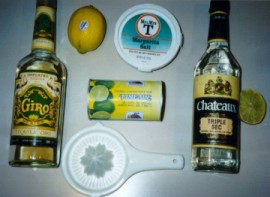

---
authors:
  - copperlight
categories:
  - Recipe
date: 2018-02-22
draft: false
pin: false
---

# Galaxy's Best Margarita

  <a class="github-button" href="https://github.com/copperlight/copperlight.github.io/issues" data-icon="octicon-issue-opened" aria-label="Discuss copperlight/copperlight.github.io on GitHub">Discuss</a>

 

*I don't recall where this came from, but the recipe is amazing, and the original site is no longer on the Internet. --copperlight*

Not a difficult one, but formulated during the great Margarita consumption in Phoenix AZ during the late 80's.

## Important Stuff

Put these ingredients in the blender. Mix the ingredients for a short period, but do not "blend". A pulsating action with four or five jolts of the blender works the best. This recipe makes 3 and a half 12 ounce margaritas.

* **Tequila** - one cup (8 ounces)
* **Triple Sec** - a quarter cup
* **Limeade Frozen Concentrate** - half can (6 ounces)
* **Lemon Juice** - one fresh lemon
* **Ice** - two cups large cubes
* **Water** - a half cup

Toss 4 ice cubes into a 12 ounce, salt rimmed glass, and then pour the margarita!

## Details

### Water

Adjust the amount of water to alter the strength of the margarita mix. Do not adjust the alcohol measurements. If they are too strong, use one cup of water in the next batch instead of a half cup.

### Ice

The most important thing is - **DO NOT CRUSH** the ice. Use large cubes in the blender. They will lose some size in the mixing process. Do not allow the ice to become a puree. Many people do not like their margaritas with crushed ice because it will freeze the roof of your mouth and can cause a headache.

### Lemon Juice

Fresh lemon juice is a must. The bottled crap should be used only as a last resort, and only if the local grocery store is closed or more than 5 miles away. Make sure when you are juicing the lemon that no seeds get into the mix.

### Lime Juice Concentrate

Minute Maid is a common brand but the only problem with Minute Maid is that there is too much pulp. I used to not recommend this brand but I am changing my tune. I have had quality problems with the lower-priced brands. Go with the **Minute Maid**.

### Tequila

Any tequila will work in this recipe. Most people think they need the most expensive tequila. Not so with this mix. Cheap white tequila works great. My favorite is **Sauza Giro Gold** tequila because it is smooth and the price is low (about $9 US for 750 ml). I do not recommend Cuervo Gold because it is overpriced (about $14) and has a rough flavor. It still turns out OK in the margarita mix, but the Sauza is cheaper and better.

### Triple Sec

Many triple sec brands have an orange flavor. I believe the best margarita is made with "neutral" triple sec. Try to use triple sec like Chateaux which is plain, and about $7 for 750 ml. It's a little more potent than the orange stuff. The problem with the orange triple sec is that it makes a margarita that is a little on the sweet side, and mixing orange flavor with lemon and lime just doesn't sound right to me.

### Salt Rim

To create a salt rimmed glass, take one of the lemon rinds from above and rub the drinking surface of the glass so it is barely moist. Dip the edge of the glass into salt. Table salt will work, but larger size margarita (or kosher) salt is better. Garnish with a lime wedge, which is merely a decoration, although some folks like to squeeze the lime juice into their drink as it goes down the hatch.

Some people do not like salt on the glass. Although 8 out of 10 like the salt, I have found that women are generally the ones who don't. You will make points with these folks if you can remember their preference in advance.

This recipe is featured on the Bacardi web site and averages 4000 quality hits per month! I am a party-er and enjoy drinking, and sharing that experience with fellow party-ers like you. Let's Party!

### A Few Editorial Comments

Some people think that you should use the best (and most expensive) liquor. This recipe is very inexpensive to make, but if you want to splurge for the better tequila, go for it! Expensive liquor makes the margarita only marginally better because of the neutralizing effect of the other ingredients. Since a margarita is a blend of several flavors, changing the tequila has limited affect.

I realize it is presumptuous to call this recipe "The Galaxy's Best." But I registered the name in Yahoo without much thought two years ago, and there it stays. It really should be named "A Good Marg!" - I'm sure everyone could agree to that.

### About Dreaded Hangovers

There are two types: first there is the "in-a-daze mild headache" kind. This hangover is solved by drinking orange juice on an empty stomach in the morning. I am serious dammit - make sure you use real orange juice. Sixteen ounces will do. The bad kind of hangover cannot be cured - you know - barfing etc.