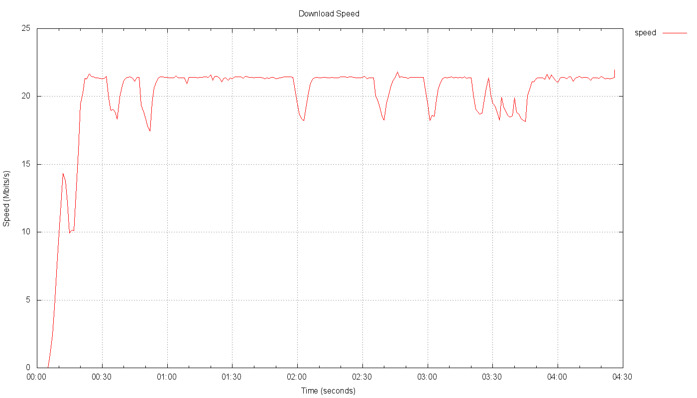

---
authors:
  - copperlight
categories:
  - curl
  - Network
  - Shell
date: 2021-12-02
draft: false
pin: false
---

# Measuring Transfer Speed Over Time with cURL

<div class="meta">
  <span class="discuss"><a class="github-button" href="https://github.com/copperlight/copperlight.github.io/issues" data-icon="octicon-issue-opened" aria-label="Discuss copperlight/copperlight.github.io on GitHub">Discuss</a></span>
</div><br/>

Ordinarily when you run the [cURL](http://curl.haxx.se/) command to download a file, you see a
progress meter that updates every second.

```text
  % Total    % Received % Xferd  Average Speed   Time    Time     Time  Current
                                 Dload  Upload   Total   Spent    Left  Speed
100   346  100   346    0     0    422      0 --:--:-- --:--:-- --:--:--   422
  4  635M    4 29.8M    0     0  1793k      0  0:06:02  0:00:17  0:05:45 2394k
```

This progress meter is written to stderr and if you were to redirect both stderr and stdout to a
file and then run `tail -f` on that file, you would see the exact same progress meter being updated
once per second, with no running log of download speed.  The reason that this output updates in
place is because the program is writing a carriage return `\r` at the end of the progress line
instead of a newline `\n`.  This causes the cursor to return to the beginning of the line without
advancing.

With the knowledge of how this operates, it is possible to alter the output of the cURL command to
save the per-second speed of a download.  If you further send the results of a large file download
to `/dev/null`, then you have a reasonable approximation of of a speedtest tool and you can graph
the download speed over time.  The command below uses `tr` to rewrite carriage returns as newlines
in an unbuffered manner, so that data is instantly available in the output file.

As an aside on the power of the [tr command](http://www.softpanorama.org/Tools/tr.shtml), the
[More Shell, Less Egg](http://www.leancrew.com/all-this/2011/12/more-shell-less-egg/) blog post by
[Dr. Drang](http://bitquill.com/home/2013/12/24/bqa-the-enigmatic-dr-drang) discusses a programming
challenge proposed to [Donald Knuth](http://en.wikipedia.org/wiki/Donald_Knuth), who solved it with
~10 pages of literate Pascal, and [Doug McIlroy](http://en.wikipedia.org/wiki/Douglas_McIlroy) who
critiqued the solution and provided an alternative solution in six shell commands.

```bash
URL="https://releases.ubuntu.com/20.04/ubuntu-20.04.3-live-server-amd64.iso"

curl -L -o /dev/null "$URL" 2>&1 \
  |tr -u '\r' '\n' > curl.out
```

This results in an output file that looks like this:

```text
  % Total    % Received % Xferd  Average Speed   Time    Time     Time  Current
                                 Dload  Upload   Total   Spent    Left  Speed

  0     0    0     0    0     0      0      0 --:--:-- --:--:-- --:--:--     0
  0     0    0     0    0     0      0      0 --:--:-- --:--:-- --:--:--     0
100   346  100   346    0     0    295      0  0:00:01  0:00:01 --:--:--   295

  0     0    0     0    0     0      0      0 --:--:--  0:00:01 --:--:--     0
  0     0    0     0    0     0      0      0 --:--:--  0:00:02 --:--:--     0
  0     0    0     0    0     0      0      0 --:--:--  0:00:03 --:--:--     0
  0     0    0     0    0     0      0      0 --:--:--  0:00:04 --:--:--     0
  0  635M    0 70871    0     0  12988      0 14:14:26  0:00:05 14:14:21 17260
  0  635M    0  608k    0     0  97534      0  1:53:46  0:00:06  1:53:40  120k
  0  635M    0 1489k    0     0   201k      0  0:53:41  0:00:07  0:53:34  296k
  0  635M    0 2742k    0     0   328k      0  0:33:00  0:00:08  0:32:52  548k
  0  635M    0 4297k    0     0   456k      0  0:23:43  0:00:09  0:23:34  849k
  0  635M    0 6015k    0     0   580k      0  0:18:40  0:00:10  0:18:30 1210k
  1  635M    1 8014k    0     0   701k      0  0:15:27  0:00:11  0:15:16 1471k
  1  635M    1 10.0M    0     0   827k      0  0:13:05  0:00:12  0:12:53 1749k
  1  635M    1 11.0M    0     0   841k      0  0:12:52  0:00:13  0:12:39 1682k
  .
  .
  .
```

Write a Python script `plot-curl-data.py` to process the data to convert it into a format useful for
[gnuplot](http://www.gnuplot.info/) and render a plot:

```python
#!/usr/bin/env python3

import subprocess
import sys


def transform_curl_data(curl_data_filename: str) -> None:
    raw_lines = []
    with open(curl_data_filename) as f:
        for line in f.readlines():
            raw_lines.append(line.split())

    converted_lines = []
    for line in raw_lines[3:]:
        if len(line) == 12 and '--' not in line[9]:
            # curl reports speed in bytes per second
            if 'k' in line[11]:
                line[11] = str(float(line[11].replace('k', '')) * 8 * 1024)
            elif 'M' in line[11]:
                line[11] = str(float(line[11].replace('M', '')) * 8 * 1048576)
            elif 'G' in line[11]:
                line[11] = str(float(line[11].replace('G', '')) * 8 * 1073741824)
            converted_lines.append([line[9], line[11]])

    with open(f'{curl_data_filename}.gnuplot.data', 'w') as f:
        for line in converted_lines:
            f.write(','.join(line) + '\n')


def plot(curl_data_filename: str) -> None:
    payload = ''.join([
        f'set output "{curl_data_filename}.png"\n',
        'set datafile separator ","\n',
        'set terminal png size 1400,800\n',
        'set title "Download Speed"\n',
        'set ylabel "Speed (Mbits/s)"\n',
        'set xlabel "Time (seconds)"\n',
        'set xdata time\n',
        'set timefmt "%H:%M:%S"\n',
        'set key outside\n',
        'set grid\n',
        'plot \\\n',
        f'"{curl_data_filename}.gnuplot.data" using 1:($2/1e6) with lines lw 1 lt 1 lc 1 title "speed"\n'
    ])

    gnuplot_command_file = f'{curl_data_filename}.gp'
    with open(gnuplot_command_file, 'w') as f:
        f.write(payload)

    try:
        subprocess.run(
            ['which', 'gnuplot'],
            check=True,
            stdout=subprocess.DEVNULL,
            stderr=subprocess.STDOUT
        )
    except subprocess.CalledProcessError:
        print(f'gnuplot is not available on the PATH')
        exit(1)

    subprocess.run(['gnuplot', gnuplot_command_file])


if __name__ == '__main__':
    if len(sys.argv) < 2:
        print(f'Usage: {sys.argv[0]} [curl_data_filename]')
        exit(1)
    else:
        transform_curl_data(sys.argv[1])
        plot(sys.argv[1])
```

Run this script like so:

```bash
./plot-curl-data.py curl.out
```

You will end up with data (`curl.out.gp.data`) and configuration files (`curl.out.gp`) like so:

```text
0:00:01,295
0:00:01,0
0:00:02,0
0:00:03,0
0:00:04,0
0:00:05,17260
0:00:06,983040
0:00:07,2424832
0:00:08,4489216
0:00:09,6955008
0:00:10,9912320
0:00:11,12050432
0:00:12,14327808
0:00:13,13778944
0:00:14,12173312
.
.
.
```

```text
set output "curl.out.png"
set datafile separator ","
set terminal png size 1400,800
set title "Download Speed"
set ylabel "Speed (Mbits/s)"
set xlabel "Time (seconds)"
set xdata time
set timefmt "%H:%M:%S"
set key outside
set grid
plot \
"curl.out.gp.data" using 1:($2/1e6) with lines lw 1 lt 1 lc 1 title "speed"
```

The graph will be rendered in PNG format:


