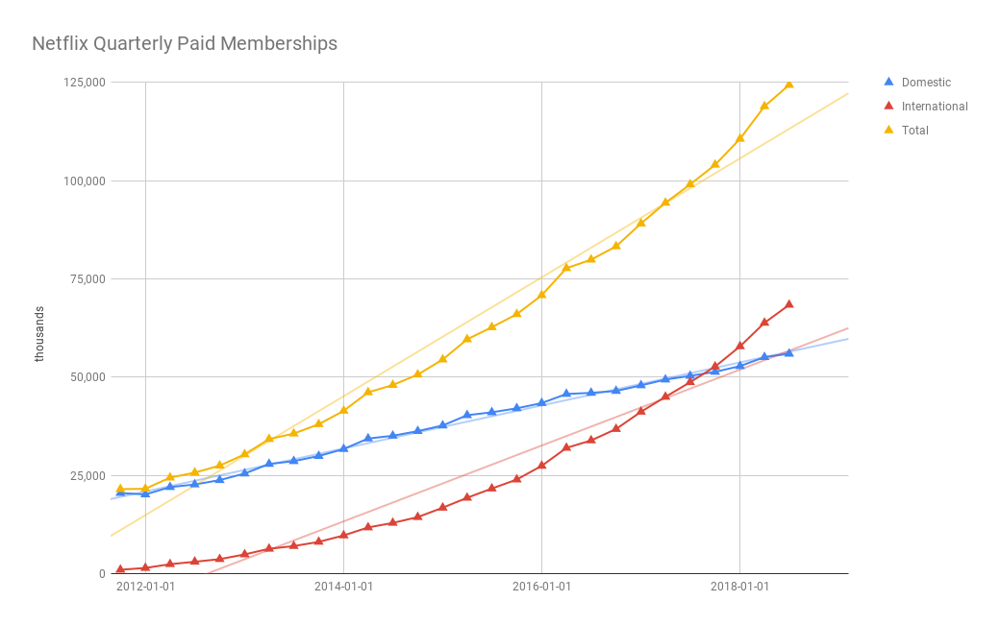
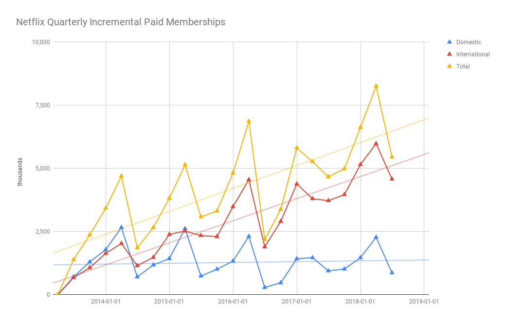

---
authors:
  - copperlight
categories:
  - Netflix
  - Stocks
date: 2018-10-04
draft: false
pin: false
---

# Netflix Quarterly Subscriber Growth

  <a class="github-button" href="https://github.com/copperlight/copperlight.github.io/issues" data-icon="octicon-issue-opened" aria-label="Discuss copperlight/copperlight.github.io on GitHub">Discuss</a>

 

All the information presented here is taken from quarterly earnings reports publicly posted on
the [Netflix Investors] website. The subscriber numbers can be found on the Segment Information
tab of the Quarterly Earnings Financial Statements spreadsheets. The Domestic and International
streaming paid memberships were first broken out separately in 2011-Q3.

The [spreadsheet] with the source data that generated these charts is available for review, so you
can see that it is a straight copy from the source.

[Netflix Investors]: https://www.netflixinvestor.com/financials/quarterly-earnings/default.aspx
[spreadsheet]: https://docs.google.com/spreadsheets/d/14kGRCkKrZktf34WmGrcAJb8TqbeCGPrK6o48oTfzezM/edit?usp=sharing

