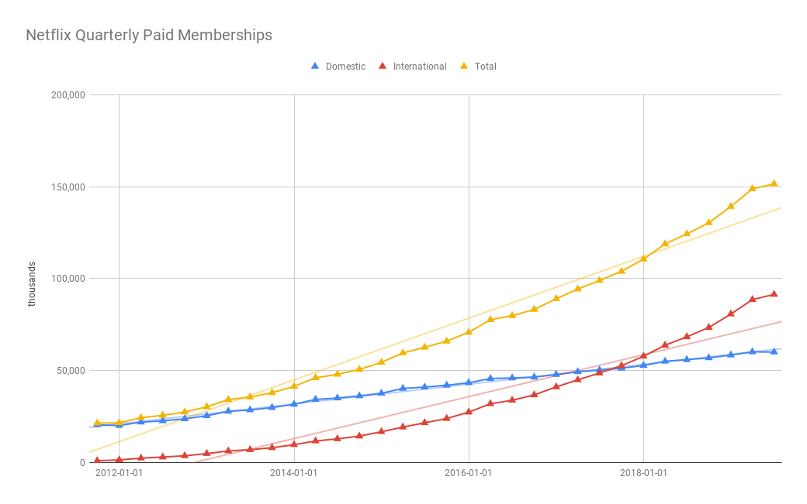
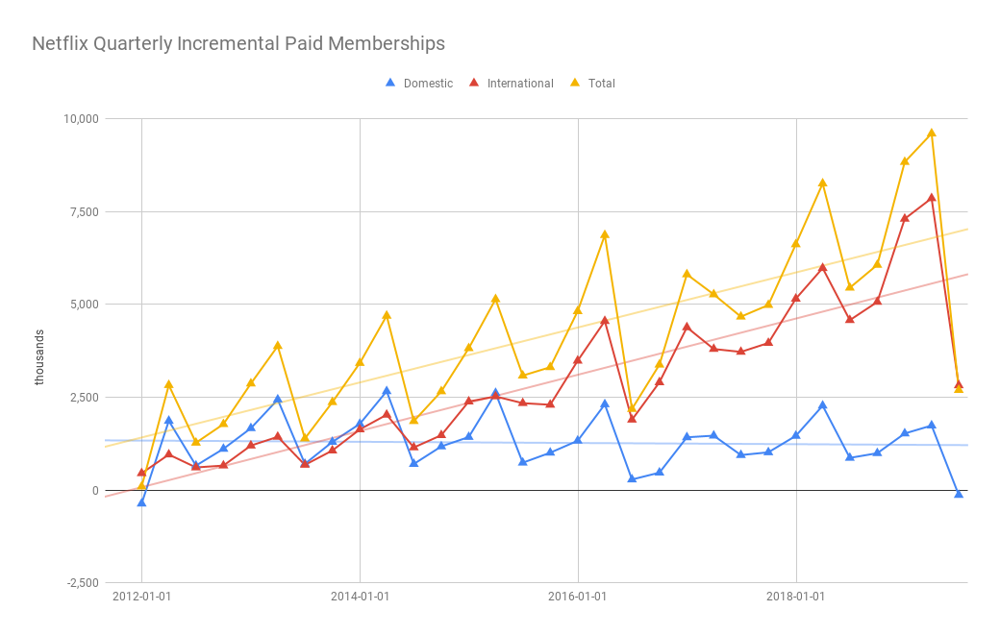

# Netflix Quarterly Subscriber Growth

All of the information presented here is taken from quarterly earnings reports publicly posted on
the [Netflix Investors] website. The subscriber numbers can be found on the Segment Information
tab of the Financial Statements spreadsheets.

The [spreadsheet] with the source data that generated these charts is available for review, so you
can see that it is a straight copy from the source.

[Netflix Investors]: https://ir.netflix.com/ir-overview/profile/default.aspx
[spreadsheet]: https://docs.google.com/spreadsheets/d/14kGRCkKrZktf34WmGrcAJb8TqbeCGPrK6o48oTfzezM/edit?usp=sharing

